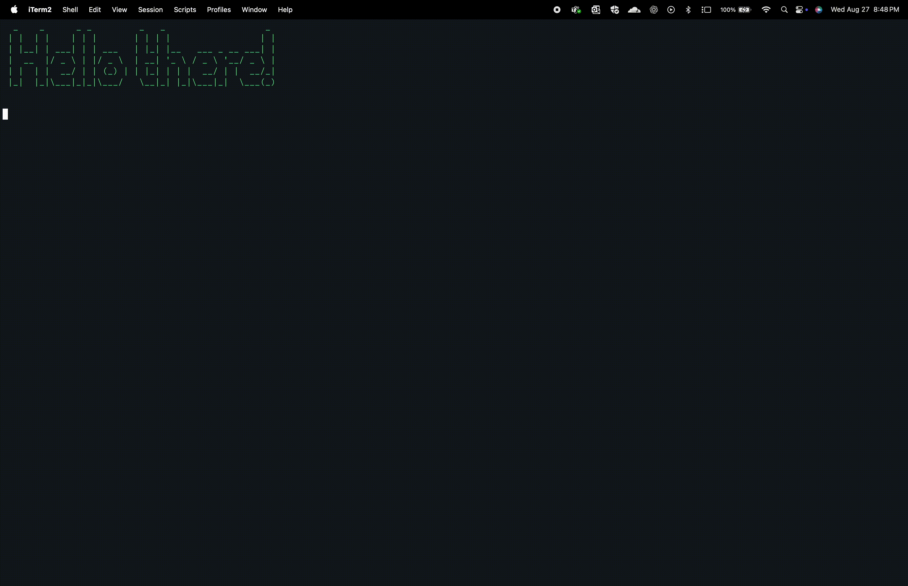
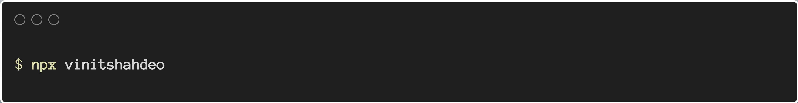

<div align="center">

<h1><code>npx vinitshahdeo</code><br/>Interactive CLI Portfolio</h1>

<strong>An interactive, delightful CLI experience to explore my digital world—right from your terminal! 🚀</strong><br/>


<br/>


<br/>
</div>


## Requirements

- **Node.js 18+**
- A terminal that supports Unicode for best results (emoji/box drawing)


## Quick Start

### Run without installing
```bash
npx vinitshahdeo
```

### Install globally
```
npm i -g vinitshahdeo
```

The global binary is exposed as `vinitshahdeo` and now you can run as a command:

```bash
vinitshahdeo
```

### Usage

`vinitshahdeo [options]`

#### Options

- `--open=site|linkedin|github|twitter` – open a destination directly and exit
- `--no-anim` – skip the animated banner (handy on slow terminals/SSH)
- `-h`, `--help` – show help

#### Examples

- `vinitshahdeo --open=github`

- `vinitshahdeo --no-anim`

> [!TIP]
> Using npx? Replace `vinitshahdeo` with `npx vinitshahdeo`.

